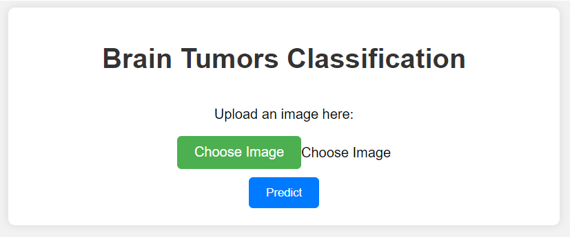
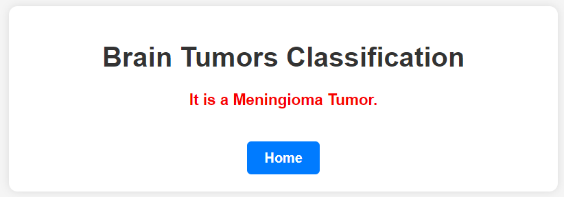

# Brain Tumors Classification Project

This project focuses on the classification of brain tumor images using deep learning technique. The dataset used for this project can be found on [Kaggle](https://www.kaggle.com/datasets/thomasdubail/brain-tumors-256x256).

## Project Overview

The project includes the following key steps:

1. **Data Preparation in Jupyter Notebook (`notebook.ipynb`):**
   - Imported necessary libraries such as NumPy, TensorFlow, and OpenCV (cv2).
   - Imported all brain tumor images and stored them in the `X` array.
   - Appended corresponding labels to the `y` array.
   - Converted the image and label lists into NumPy arrays.
   - Normalized the image data by dividing by 255 and saved the results in `X_scaled`.
   - Performed label encoding on `y` and saved the results in `y_ohe`.
   - Converted the one-hot encoded labels into categorical format and saved in `y_cat`.
   - Split the data into training and testing sets using `train_test_split`.

2. **Model Building:**
   - Created and trained a deep learning model with:
     - 4 convolution layers.
     - 4 max-pooling layers.
     - 1 flatten layer.
     - 1 dense layer.

   - Additionally, built and trained another model with:
     - 6 convolution layers.
     - 6 max-pooling layers.
     - 1 flatten layer.
     - 1 dense layer.

   - Explored the usage of pre-trained models such as VGG16, InceptionV3, and ResNet50 for the classification task.

   - After evaluating all models, it was decided that VGG16 performed the best with an accuracy score of 0.92.

3. **Web Application (Flask):**
   - Created a Flask web application in the `app.py` file to allow users to classify brain tumor images.
   - Included a `templates` directory with two HTML files:
     - `index.html`: The main page for uploading and classifying images.
     - `prediction.html`: The page for displaying the classification results.

4. **Requirements:**
   - A `requirements.txt` file is included, listing all the necessary Python libraries and packages required to run the Flask web application.

## Running the Flask Web App

To run the Flask web app, follow these steps:
1. Install the required libraries listed in `requirements.txt` using `pip install -r requirements.txt`.
2. Run the Flask app by executing `python app.py`.
3. Open the web app in your browser by navigating to `http://localhost:5000`.

Feel free to reach out if you have any questions or need further assistance. Enjoy your cat-dog classification project!

## Webpage Glimpse:

